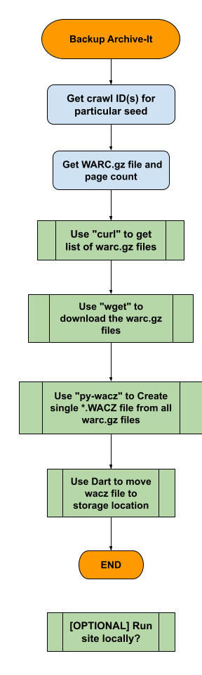

Process for backing up WARCs from Archive-it to MiDPN

Backup from Archive-It, partially based on this article: 
How to find and download your WARC files with WASAPI – Archive-It Help Center
https://support.archive-it.org/hc/en-us/articles/360015225051-How-to-find-and-download-your-WARC-files-with-WASAPI

 

