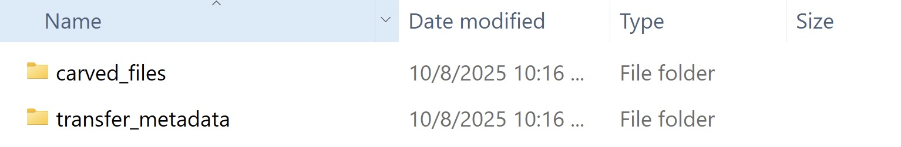
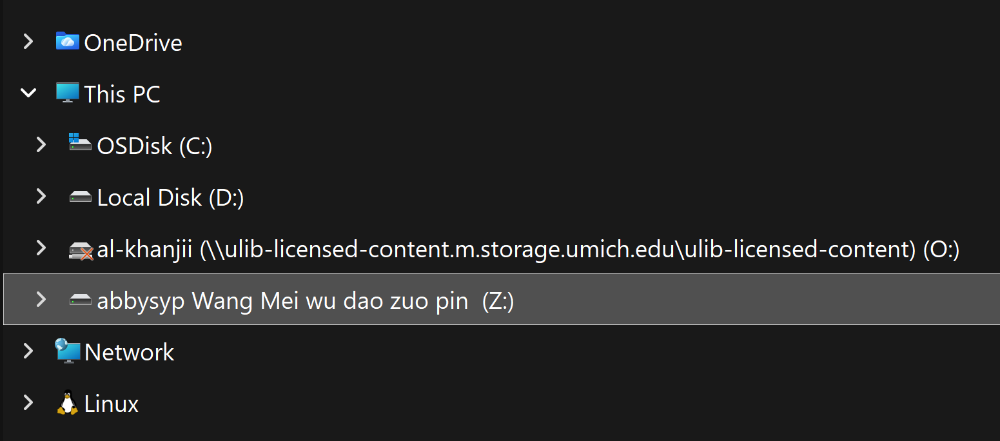
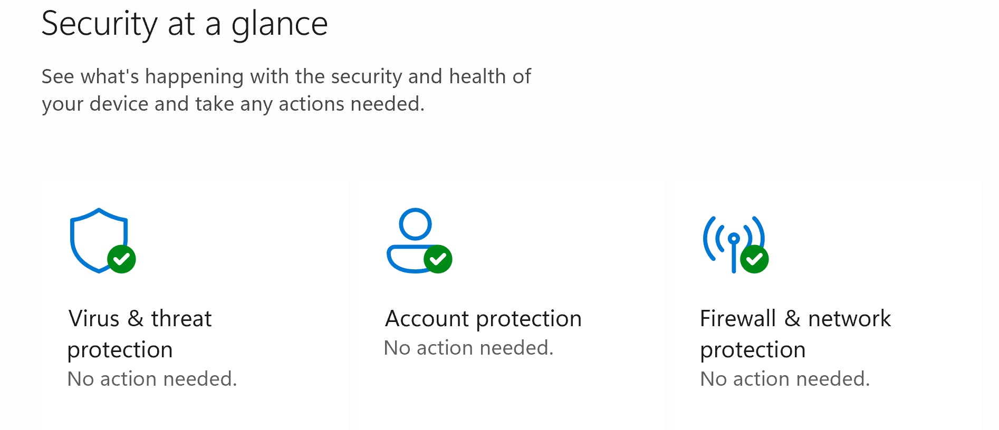
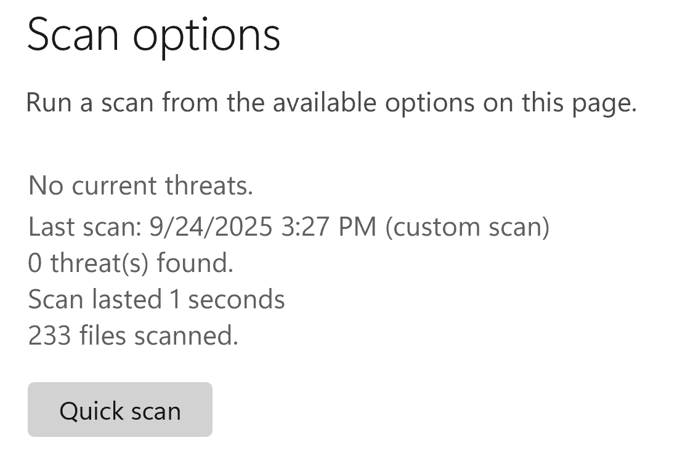

# 2026 Summer Askwith Project

_Last updated on June 16, 2025_

## 📁 Prepare Media Directory
   
1. For each transfer, create an empty folder and name it the corresponding barcode.

6. Within the top-level barcode folder, create two additional folders called **carved_files** and **transfer_metadata**.

   
  
8. Continue to **Rclone Mount and Virus Scan**.

# Rclone Mount and Virus Scan

## 📁 Rclone Mount

1. Open the 'rclone mount' shortcut on the Desktop of Yoda.
2.    Once the command has run, you should be able to access the folder through Windows File Explorer.

      

## 🦠 Running Falcon Crowdstrike

1. Open **Windows Security** from the Desktop Search Bar.
   
3. From the dashboard, select **Virus & threat protection**.

   
   
5. _Underneath_ the button that says Quick scan, select **Scan options**.
   
7. Select **Custom scan**, then choose the directory in File Explorer can be found.
8. Run the scan, then scroll back to **Scan options** at the top - you should see the results of the virus scan.

   
   
10. If all looks clear, continue File Transfer.

# File Transfer

1. Click and drag one video file from the R: drive in File Explorer to the **carved_files** folder you created.
2. When prompted, click **Teracopy**.
3. Once the transfer is finished, double check that the file is there.
4. 7. Continue to [Packaging and Transfer Workflow](https://github.com/mlibrary/digiPres/blob/main/workflows/docs/PACKAGING.md#packaging-and-transferring-files-to-archivematica).
