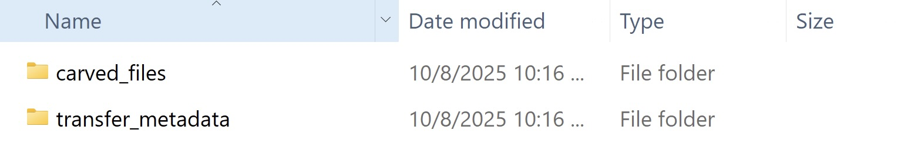
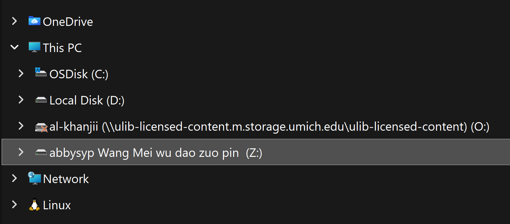
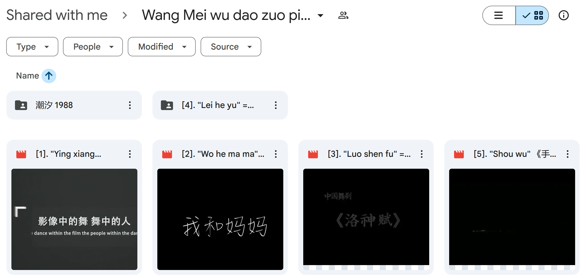

# Cloud (Google Drive or Dropbox)

_Last updated on November 13, 2025_

## 📁 Prepare Media Directory

_These instructions are adapted for the Windows machine (Yoda) in the Digital Preservation Lab._
   
1. For each transfer, create an empty folder and name it the corresponding barcode. Note that for cloud files, we assign a barcode but toss the sticker afterwards to prevent reuse.

6. Within the top-level barcode folder, create two additional folders called **carved_files** and **transfer_metadata**.

   
  
8. Continue to **Rclone Mount and Virus Scan**.

## 🦠 Rclone Mount and Virus Scan

_Rclone is a command-line tool for managing files on cloud storage services like Google Drive and Dropbox. First, you may need to configure your Google or Dropbox drive to access the shared files you would like to download, instructions for each are linked below._

+ _[Google Drive](https://rclone.org/drive/)_
+ _[Dropbox Drive](https://rclone.org/dropbox/)_

_These instructions are adapted for the Windows machine (Yoda) in the Digital Preservation Lab._

1. In a terminal, locate the **rclone** folder on the Desktop of Yoda and `cd` into it.
2. Once you are in **rclone**, enter:

    ```
    rclone mount [drive name]:"[folder name]" Z: --read-only
    ```
    **💡 Command Breakdown**
    + `rclone mount` mounts a drive to a local computer
    + `[drive name]:"[folder name]"` is the name of the folder containing the files
    + `Z:` is the local drive we want to mount the files to
    + `--read-only` ensures that we can't accidentally overwrite or delete the files

    Here's a more specific example:
    
    ```
    rclone mount abbysyp:"Wang Mei wu dao zuo pin xuan ji" Z: --read-only
    ```
   Once the command has run, you should be able to access the folder through Windows File Explorer.

   

3. Follow the steps to run a [Virus Scan](https://github.com/abbysyp/digipreslabdocs/blob/main/docs/VIRUS-SCAN.md#virus-scan) on that directory.
   
5. Continue to **Rclone File Transfer**.

## 🔁 Rclone File Transfer

_These instructions are adapted for the Windows machine (Yoda) in the Digital Preservation Lab._

1. First, navigate to the folder you would like to download in Google Drive or Dropbox and **copy** the name to your clipboard.

   

3. In the terminal, double check that you are still in the **rclone** folder.
4. Once you are in **rclone**, enter:

    ```
    rclone md5sum [drive name]:"[folder name]" > [transfer metadata folder path]\checksums.txt
    ```
    **💡 Command Breakdown**
    + `rclone md5sum` generates an md5 checksum for each file while it is still located on the drive
    + `[drive name]:"[folder name]"` is the name of the folder containing the files
    + `> [transfer metadata folder path]\checksums.txt` writes the output to a file called checksums.txt in our metadata folder

    Here's a more specific example:
    
    ```
    cd C:\Users\lstuch1\Desktop\rclone
    ```
    ```
    rclone md5sum abbysyp:"Wang Mei wu dao zuo pin xuan ji" > C:\Users\lstuch1\Desktop\39015092248429\transfer_metadata\checksums.txt
    ```
   Once the command has run, check that the file is there and that its contents look valid.
6. Enter the command:

    ```
    rclone copy [drive name]:"[folder name]" [carved files folder path]
    ```
    **💡 Command Breakdown**
    + `rclone copy` copies files from one location to another
    + `[drive name]:"[folder name]"` is the name of the folder containing the files we want to copy
    + `[carved files folder path]`is where want the copied files to go

   Here's a more specific example:
    
   ```
    rclone copy abbysyp:"Wang Mei wu dao zuo pin xuan ji" C:\Users\lstuch1\Desktop\39015092248429\carved_files
    ```
   Once the command has run, check that the files have been downloaded into your **carved_files** folder.

7. Continue to [Packaging and Transfer Workflow](https://github.com/abbysyp/digipreslabdocs/blob/main/docs/PACKAGING.md#packaging-and-transferring-files-to-archivematica).

   
