# Floppy Disk

_Last updated on January 8, 2026_

## 📁 Prepare Media Directory

_These instructions are adapted for the Windows machine (Yoda) in the Digital Preservation Lab._
   
1. For each physical disk, create an empty folder and name it the corresponding **barcode**.

6. Within the top-level barcode folder, create two additional folders called **carved_files** and **transfer_metadata**. If you are working with an Apple 3.5" or 5.25" floppy, create an additional folder called **image**.

   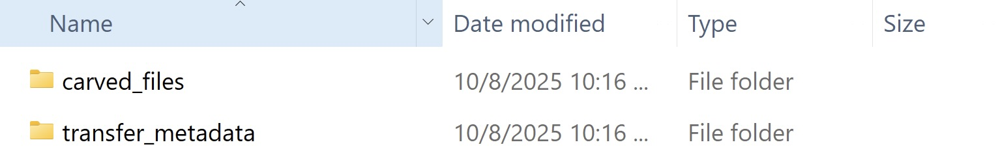
  
8. Continue to **Getting Carved Files**.

## 💾 Getting Carved Files

For 3.5” Apple and 5.25” floppies, we must extract an image from the disk using specialized equipment in the lab. For standard 3.5” floppies, we’re able to grab the carved files right off of the disk using FTK.

This workflow covers all methods, so first identify the type of floppy disk you’re working with then follow the instructions accordingly.

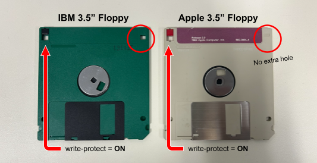

I am working with a...

   + [3.5" IBM](https://github.com/mlibrary/digiPres/blob/main/workflows/docs/FLOPPY.md#floppy-reader)
   + [3.5" Apple](https://github.com/mlibrary/digiPres/blob/main/workflows/docs/FLOPPY.md#kryoflux)
   + [5.25"](https://github.com/mlibrary/digiPres/blob/main/workflows/docs/FLOPPY.md#fc5025)

### KryoFlux

1. Connect KryoFlux via USB without connecting to external power supply.
2. Open the folder **kryoflux_3.00_windows** on Desktop and find the **dtc** folder.
3. In the terminal, enter:
   
    ```
    cd [path to dtc folder]
    ```
  
4. Next, enter:

   ```
    dtc -c2
    ```

   This should return with the message `CM: maxtrack=0`.

5. Plug KryoFlux into external power supply, or turn powerstrip on.
   
6. Again, enter:

   ```
    dtc -c2
    ```

   Now, it should return with the message `CM: maxtrack=83`.

7. In File Explorer, open the application **kryoflux-ui.jar** located in the **dtc** folder.
8. Navigate to **File → Settings → Output Tab** and change the output file path to the corresponding disk image folder.
9. Insert floppy into the reader.
10. On the toolbar, locate the Drive tab and make sure **Drive 0** is selected.

    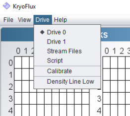
   
12. Under the Control bar, enter the barcode as the image name, then select the type of disk you want to read. In most cases, it’s **Apple DOS 400K/800K sector image**.

     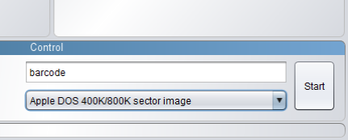
    
14. Press **Start** and wait for the image to be made.

    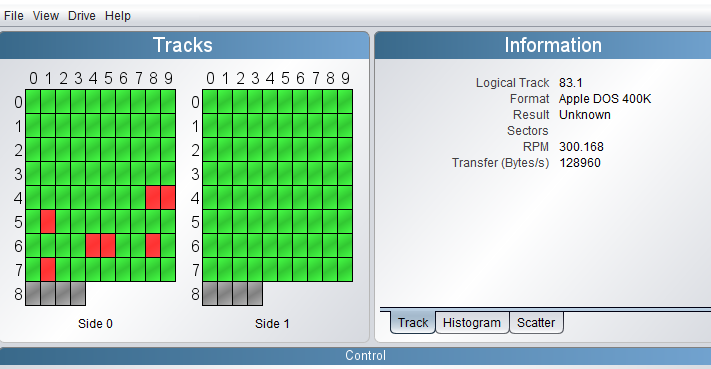

    There are two grids that will fill up with color indicators, each grid represents a side of the disk (sometimes your disk may be only one-sided, so one grid will be empty), and each square in the grid represents a sector of the disk.

    **🔑 Color Key**
      + Green = track decoded, no errors found
      + Grey = noise (or unknown encoding scheme)
      + Red = track decoded, error(s) found, reading will be retried
      + Yellow = notifications and warnings, e.g. additional header data
      + Glowing = track is being dumped
   
16. Remove the media and disconnect the hardware first from the power strip, then the computer.
17. Your disk image and log file can now be found in your **image** folder.
18. Continue to [**Logical Transfer of Files**](https://github.com/abbysyp/digipreslabdocs/edit/main/docs/FLOPPY.md#-logical-transfer-of-files).

### FC5025

1. Configure external setup for FC5025.

   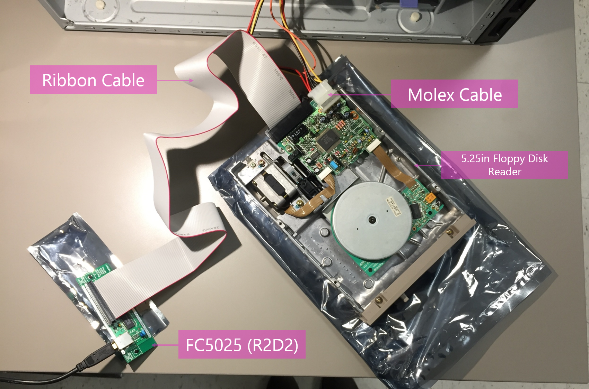
   
3. On the desktop, open **Disk Image and Browse**.
4. Select **Disk Type**, typically **MS-DOS 360k**.

   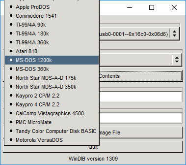
   
6. Drag the image folder path into **Image Output Directory** box.
7. Enter the barcode in the **Output Image Filename** box.
8. Select **Capture Disk Image File**.

   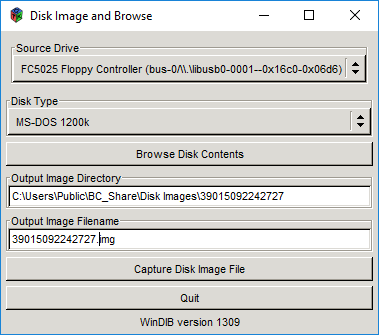
   
10. Select **Done** and check that the image is there. It may say **Bummer!** instead of **Done**. Click on the prompt and check the image folder anyways...sometimes it still works.

    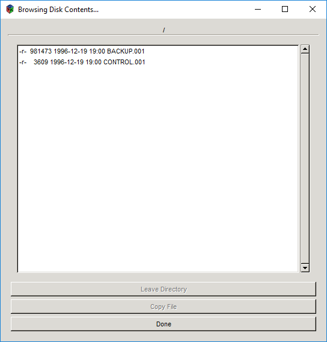
    
    If it continues to fail, try using [KryoFlux](https://github.com/mlibrary/digiPres/blob/main/workflows/docs/FLOPPY.md#kryoflux) with the 5.25” drive.
13. Continue to [**Logical Transfer of Files**](https://github.com/mlibrary/digiPres/blob/main/workflows/docs/FLOPPY.md#-logical-transfer-of-files).

### Floppy Reader

1. Connect disk reader via USB to the computer.
   
3. Insert disk into reader.

   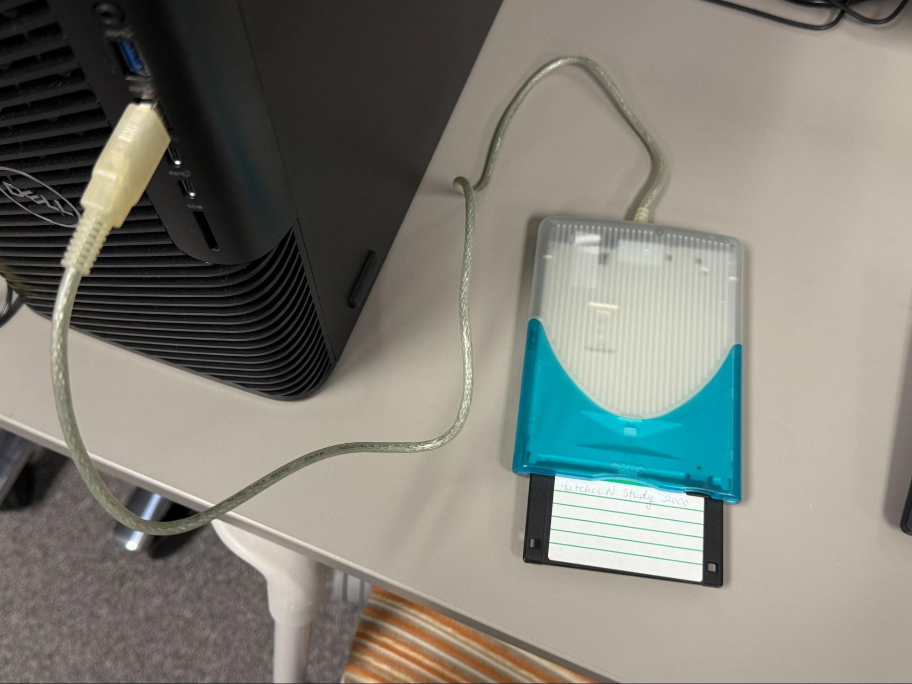

5. Continue to [**Logical Transfer of Files**](https://github.com/mlibrary/digiPres/blob/main/workflows/docs/FLOPPY.md#-logical-transfer-of-files).

## 🔁 Logical Transfer of Files

1. From the desktop open **AccessData FTK Imager**.
2. Select **File → Add Evidence Item**.

   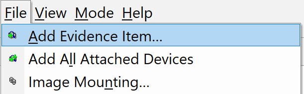

4. Next, choose one of two options:
   
     + _If you already extracted a disk image using KryoFlux or FTK_, select **Image File** then **barcode → image → image file (.E01)** as the Source Path
       
     + _If you are extracting files via USB reader_, select **Logical Drive > A:\\** then click **Finish**
       
5. Under **Evidence Tree**, click on **+** to expand the directories until you see **[root]** or **[HTE]** and click on it.

   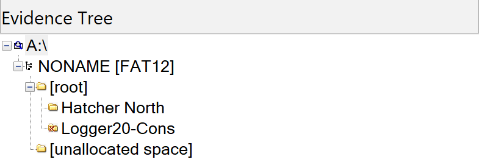
   
7. In the **File List** panel, select everything using **Ctrl+click**.
8. Once all the files are highlighted, **right-click** and select **Export Files**.

   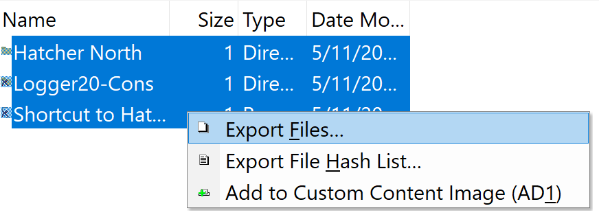
   
10. Select **barcode → carved_files** as the destination folder then click **OK**.
11. **Right-click** the highlighted files again in FTK and select **Export File Hash List**.
    
13. This time, select **barcode → transfer_metadata** as the destination folder. Enter filename as **checksums** then click **OK**.

    Essentially, we are asking FTK to generate a csv of MD5 and SHA1 checksums for each of the carved files as early as possible. We will use this later to double-check that the files haven’t changed.

14. Double check that both the **carved files** and **checksums.csv** are there:
   
     + _If it was a clean transfer_, you may now delete the image and image folder.
       
     + _Otherwise_, please talk to your supervisor so that a decision can be made about whether or not to retain the disk image.

15. Continue to [Packaging and Transfer Workflow](https://github.com/mlibrary/digiPres/blob/main/workflows/docs/PACKAGING.md#packaging-and-transferring-files-to-archivematica).
   


   
