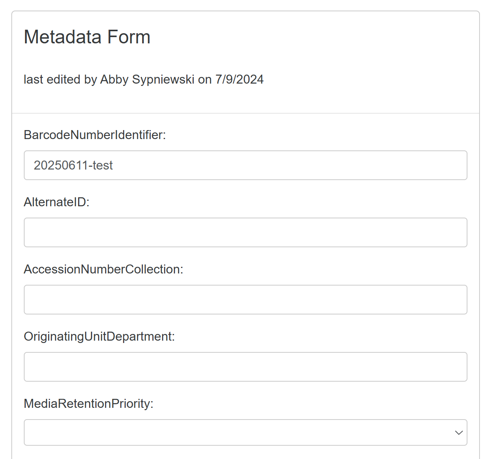
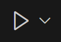
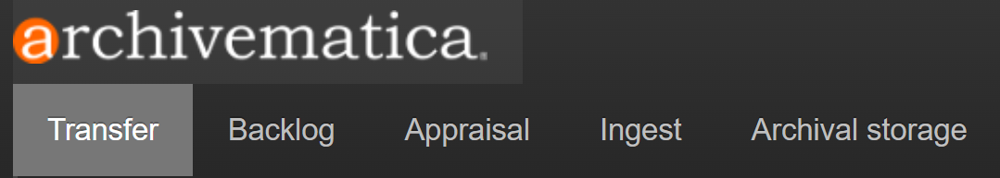
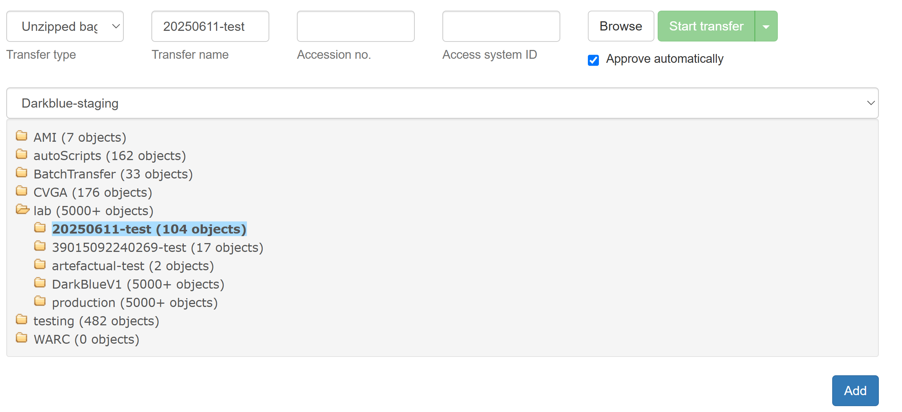
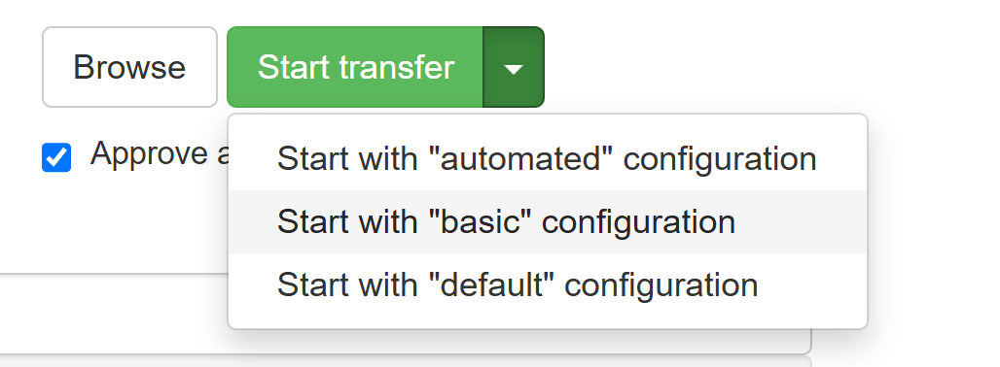
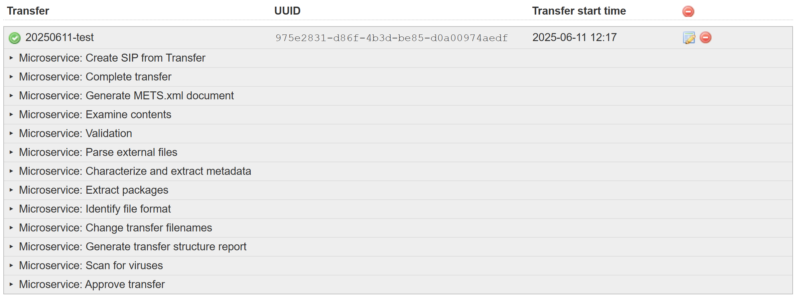
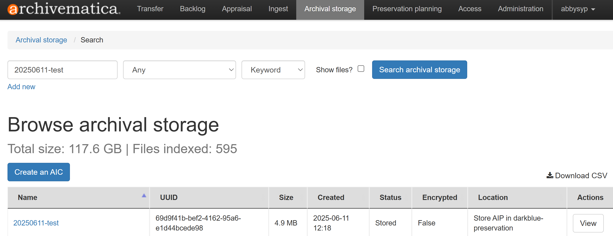

# Packaging and Transferring Files to Archivematica

_Last updated on November 12, 2025_

## 🌳 Generate File Tree

_These instructions are adapted for the Windows Terminal syntax._

1. Open a terminal window then `cd` into your **barcode → carved_files** folder.
   
4. Once you are in **carved_files**, enter:
    ```
    tree /A /f > [transfer_metadata folder path]\tree.txt
    ```
    **💡 Command Breakdown**
    + `tree` is a built in Windows tool that displays a directory’s structure
    + `/A` indicates that we want the output in a human-readable format
    + `/f` indicates that we want to include filenames for each folder/sub-folder
    + `> filename` pushes the output to a new file that we’re calling tree.txt

   Here's a more specific example:

   ```
   cd C:\Users\lstuch1\Desktop\39015092248429\carved_files
   ```
   ```
   tree /A /f > C:\Users\lstuch1\Desktop\39015092248429\transfer_metadata\tree.txt
   ```
    If there are non-Roman characters in the filenames, just enter `tree /A /f`, which will print the output to the terminal. Copy and paste this directly into a new plaintext document. Name it **tree.txt** then save it in  **transfer_metadata**.
6. Continue to **Generate Brunnhilde Reports**.

## 📋 Generate Brunnhilde Reports

_These instructions are adapted for the Windows Terminal syntax._

1. In the terminal, enter the following command:
   
    ```
    python -m brunnhilde -n [path to carved files] [path to transfer_metadata]\brunnhilde_reports
    ```
   Note: In some cases, we may want to extract PII reports. If so, add `-b` after `-n` to turn on **bulk_extractor**.

   **💡 Command Breakdown**
    + `python -m brunnhilde` calls the brunnhilde module
    + `-n` turns off ClamAV virus scan
    + `-b` runs bulk_extractor to generate PII reports
    + `[path to carved files]` is the folder we want to run the reports on
    + `[path to transfer_metadata]\brunnhilde_reports` is where the reports will go

   Here's a more specific example:

   ```
   python -m brunnhilde -nb C:\Users\lstuch1\Desktop\39015092248429\carved_files C:\Users\lstuch1\Desktop\39015092248429\transfer_metdaata\brunnhilde_reports
   ```
3. In **brunnhilde_reports**, open and inspect the **report.html** file in a browser. If using bulk_extractor, also inspect those logs for personally identifiable information.
   
4. If anything looks out of the ordinary, please talk to your supervisor so that a decision can be made about whether or not to keep/further inspect the files.
   
      💡 **A note on PII**
   > When we have to ingest digital materials on a considerably large scale, there may be several obstacles we have to face. One such obstacle is the presence of personally identifiable information or PII. Examples of PII might include: **Social Security numbers**, **credit card numbers**, **phone numbers**, **email addresses**, **student records**, and **medical records**. It can be difficult to locate and identify, as it could present itself in many different file formats and even unallocated space (previously deleted files) on disks. We use Brunnhilde to assist us with locating possible PII, and while it will detect many forms of it, some documents such as student essays may not be flagged by Brunnhilde/bulk_extractor and it is up to us to use our best judgment to protect their private information.
   >
   > _**If you see something in a disk’s files that looks suspicious and might violate someone’s rights or privacy, make note of it and speak to a supervisor right away.**_
   
6. Continue to **Metadata Form**.

## 📝 Metadata Form

_These instructions are adapted for the Windows machine (Yoda) in the Digital Preservation Lab._

1. Open up the **Desktop → ExpressProjects → Metdata_Form** folder in VS Code.
2. In VS Code, open up the terminal by clicking **View → Terminal** in the top navigation bar.
3. In the terminal, enter the following commands in order:

    ```
    npm install
    ```
    ```
    npx cross-env DEBUG=Metadata_Form:* npm start
    ```
    **💡 Command Breakdown**
    + `npm install` makes sure that the package we’re using is up to date
    + `npx cross-env DEBUG=Metadata_Form:* npm start` activates the form as a mini app in a local server

    This creates a local server that can be accessed through a browser which will allow us to see the form and download **metadata.txt**.
   
5. In a browser, navigate to **localhost:3000** using the search bar. You should see the metadata form!

   
   
7. For each bag, fill in any relevant fields (if a field is N/A, just leave it blank).
   
9. When all fields are filled out, click **Submit**. If prompted, select **barcode → transfer_metdata** as the destination folder - otherwise, manually move the file from Downloads to the corresponding transfer_metadata folder.
    
11. When done using the metadata form, type `Ctrl^C` in the terminal to close the server. You’ll be prompted by the terminal, enter `Y` then hit **Enter**.
    
13. Continue to **BagIt and Checksum Validation**.

## ✅ BagIt and Checksum Validation

_These instructions are adapted for the Windows machine (Yoda) in the Digital Preservation Lab._

1. Find **bagit-and-checksum-validation.py** script on the Desktop of Yoda and open it in VS Code.
2. In the top right corner, click the **Play Icon** to run the script.

   
   
4. Follow the input prompts in the terminal by clicking and dragging each file path then pressing **Enter**. After being prompted for the top-level barcode directory, _make sure File Explorer is closed before pressing **Enter**!!!_ Otherwise, you’ll get a File Permission error.

   Here's a more specific example of the terminal prompts and output:
    ```
    Enter path to the metadata text file you just generated: c:\Users\lstuch1\Desktop\39015092248429\transfer_metadata\metadata.txt
    
    Enter path to the top-level barcode directory: c:\Users\lstuch1\Desktop\39015092248429
    
    yay! bag is valid
    
    Enter path to the checksums.csv file that FTK generated: c:\Users\lstuch1\Desktop\39015092248429\data\transfer_metadata\checksums.csv
    
    Enter path to the manifest-md5.txt file that bagit generated: c:\Users\lstuch1\Desktop\39015092248429\manifest-md5.txt
    
    Enter path where you want failed_checksums.txt file to go: c:\Users\lstuch1\Desktop\39015092248429\data\transfer_metadata
    
    finished! validated 27 files
    ```

6. If a **failed_checksums.txt** file was generated, investigate the results and restart from the corresponding workflow:
   * Floppy Disk
   * [USB or Hard Drive](https://github.com/abbysyp/digipreslabdocs/blob/main/docs/USB.md#usb-or-external-hard-drive)
   * [Cloud](https://github.com/abbysyp/digipreslabdocs/blob/main/docs/CLOUD.md#cloud-google-drive-or-dropbox)
     
7. Otherwise, continue to **Transfer to Archivematica**.

## 🏁 Transfer to Archivematica

_Great job, you're almost at the finish line!_

1. Navigate to **ulib-darkblue-staging** in File Explorer and add your bag to **lab → production**.
   
3. Launch **archivematica-lab** in a browser window and make sure you’re in the **Transfer tab**.

   
   
4. Select **Unzipped bag** from the dropdown menu and enter **barcode** as the **Transfer name**.
   
6. Select **Browse** and find the bag you want to transfer. Click on it once, then select the blue **Add** button.

   
   
7. On the **Start transfer button**, select **“Start with ‘basic’ configuration”** and Archivematica will start processing the bag.

   
   
9. You can track Archivematica’s progress by scrolling down:

   
   
11. Once you see the green checkmark next to the barcode, check the **Archival Storage** tab to ensure it was stored correctly.

    

_All done, nice job!_ 🥳
