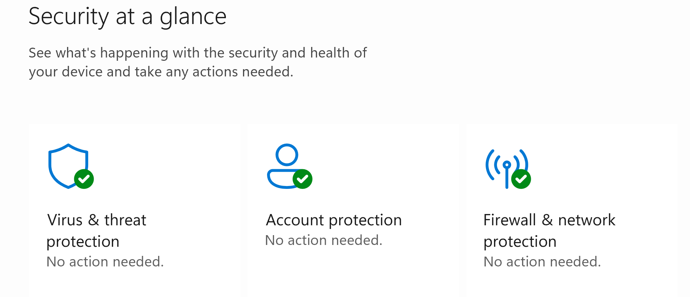
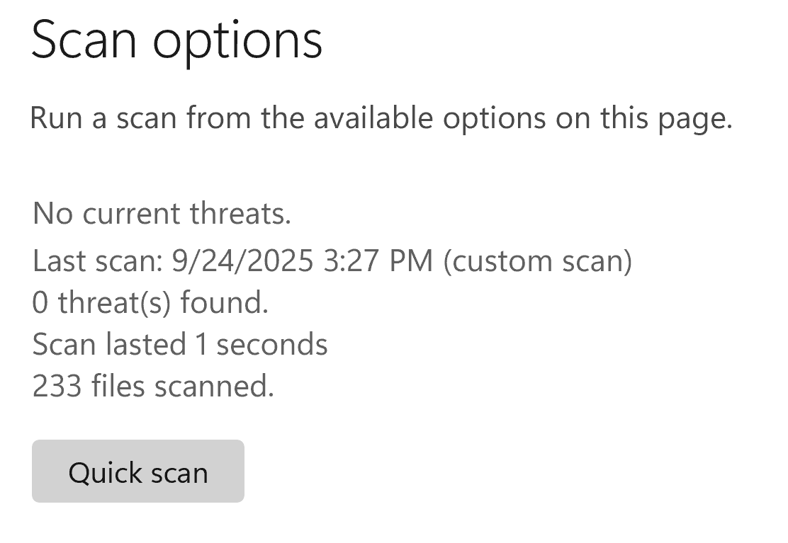

# Virus Scan

_Last updated on November 19, 2025_

## 🔍 Identify Files

_These instructions are adapted for the Windows machine (Yoda) in the Digital Preservation Lab._

1. Let's identify where we want to point the virus scanning software:
   * If you are working with a **physical** or **cloud drive** OR a **3.5" floppy disk in a USB reader**, the files we want to scan should be located in **File Explorer**.
  
      

   💡 **Why Scan Now?**

   > When plugging physical media carriers like a thumb drive directly into the lab computer (even via write blocker), we are putting that computer at risk. We want to be able to identify any viruses as quickly and contained as possible. In other words, while the computer is **disconnected** from the network and **before** copies of the files have been made.

## 🦠 Running Falcon Crowdstrike

_These instructions are adapted for the Windows machine (Yoda) in the Digital Preservation Lab._

1. Open **Windows Security** from the Desktop Search Bar.
   
3. From the dashboard, select **Virus & threat protection**.

   
   
5. _Underneath_ the button that says Quick scan, select **Scan options**.
   
7. Select **Custom scan**, then choose the directory in File Explorer can be found.
8. Run the scan, then scroll back to **Scan options** at the top - you should see the results of the virus scan.

   
10. If all looks clear, continue to the next step in the corresponding workflow:
      * Floppy Disk
      * [USB or Hard Drive](https://github.com/abbysyp/digipreslabdocs/blob/main/docs/CLOUD.md#-rclone-file-transfer)
      * [Cloud](https://github.com/abbysyp/digipreslabdocs/blob/main/docs/CLOUD.md#-rclone-file-transfer)
